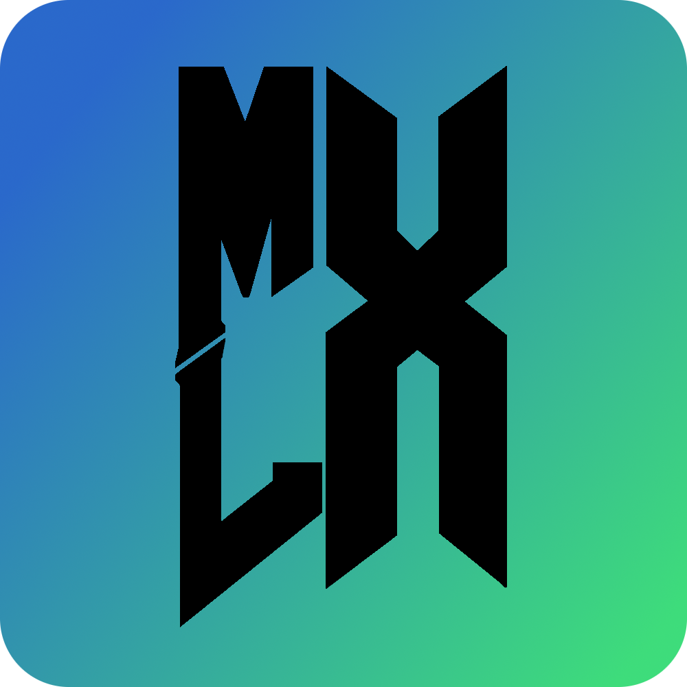

<div align="center">
    
    <h1>MLX</h1>
</div>

MLX is a simple, general-purpose Doom launcher built with Avalonia.

The main goal is to be simple, easy to use, and heavily portable (in the sense it can be shoved on a USB stick).

The UI is built to be similar to ZDL, but not have the sub-menus that ZDL had. 
Everything you need is on the main screen.

MLX attempts to be the successor to Minty Launcher in some ways, but is not the same.

# Building
## Prerequisites
* [.NET 10.0 SDK](https://dotnet.microsoft.com/en-us/download/dotnet/10.0)
* [Avalonia](https://github.com/avaloniaui/avalonia)
* [DiscordRichPresence](https://github.com/Lachee/discord-rpc-csharp)

Clone the repo:
```
git clone https://github.com/CoderPenguin1-dev/MLX.git
```

Move into build directory:
```
cd "MLX/MLX"
```

Build & Run Debug binary:
```
dotnet run
```
It should open up afterwards. The build will be in `MLX\bin\Debug\net9.0`.

# Credits & Legalese
MLX is programmed by CoderPenguin1.

MLX is under the GPLv3 license. Read COPYING for more details.

The MLX logo was created by Aries-Dragon Productions.

The MLX logo is under the [CC-BY-NC 4.0 License](https://creativecommons.org/licenses/by-nc/4.0/).

The MLX logo utilizes a modified version of the AmazDooM font by AmazingMax.

The AmazDooM font is under the [CC-BY-NC 3.0 License](http://creativecommons.org/licenses/by-nc/3.0).

MLX utilizes the Avalonia framework for its UI.

Avalonia is under the [MIT License](https://avaloniaui.net/legal-center/avalonia-license).

MLX utilizes DiscordRichPresence (Discord-RPC-CSharp).

Discord-RPC-CSharp is under the [MIT License](https://github.com/Lachee/discord-rpc-csharp/blob/master/LICENSE).

MLX utilizes and adapts some code from Minty Launcher.

Minty Launcher is under the [MIT License](https://github.com/CoderPenguin1-dev/Minty-Launcher/blob/master/LICENSE.MD).
